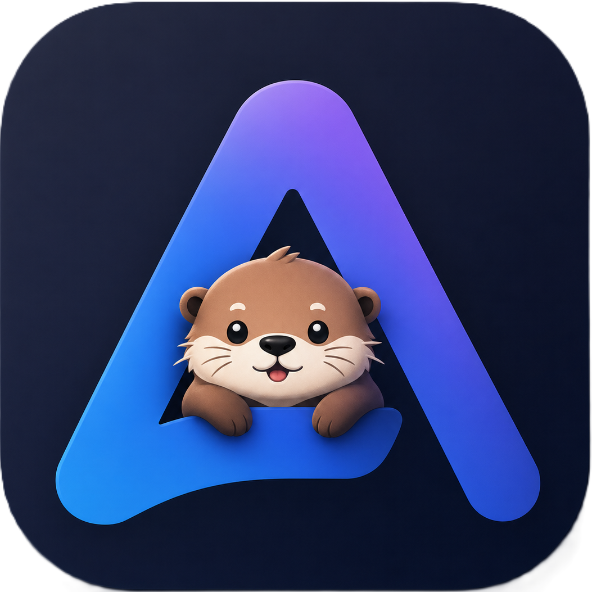
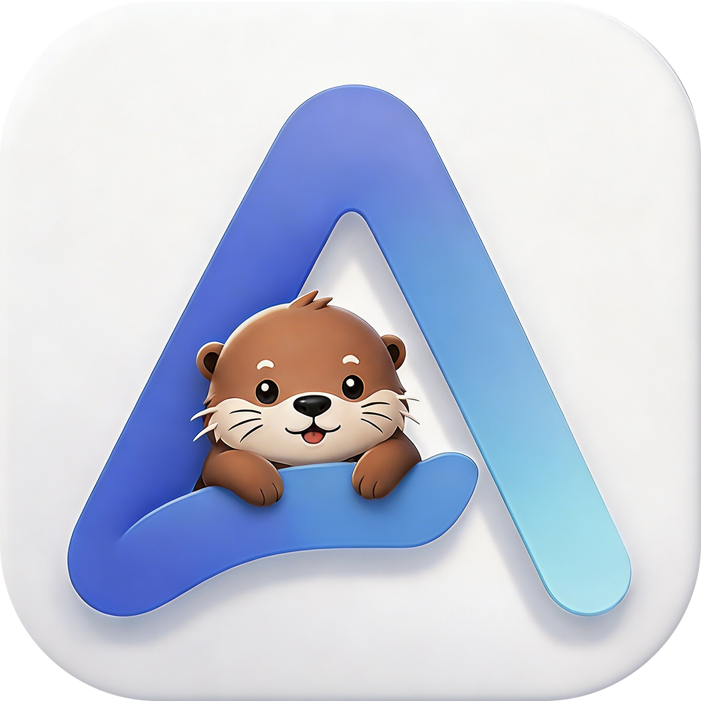

<div align="center">
  <picture>
  <source media="(prefers-color-scheme: light)" srcset="public/brand/logos/app-light.png" />
  
</picture>
  <h1>Adnify</h1>

  <p><strong>中文</strong> | <a href="README.md">English</a></p>

  <p><strong>Connect AI to Your Code.</strong></p>
  <p>一个拥有极致视觉体验、深度集成 AI Agent 的下一代代码编辑器。</p>

  <p>
    <a href="https://deepwiki.com/adnaan-worker/Adnify"></a>
    
    
    
    
  </p>
</div>

Adnify 不仅仅是一个编辑器，它是你的**智能编程伴侣**。它复刻并超越了传统 IDE 的体验，融合了 Cyberpunk 玻璃拟态设计风格，内置强大的 AI Agent，支持从代码生成到文件操作的全流程自动化。

<!-- 主界面演示 -->
<div align="center">
  
</div>

---
### 🏆 荣誉奖杯：鸣谢墙

> "Adnify 的每一行代码，都有大家投喂的能量注入！" ⚡️

感谢以下慷慨的支持者，你们提供的咖啡、奶茶和能量饮料是 Adnify 进化最强劲的动力！

| 支持者 | 投喂方式 | 荣誉称号 | 日期 | 留言 |
| :--- | :--- | :--- | :--- | :--- |
| okay. | 🧋 奶茶 | **快乐源泉注入者** | 2026-03-07 | 一杯快乐水，代码没 Bug！✨ |
| 唐先生 | ☕ 咖啡 | **专注燃料赞助者** | 2026-04-17 | 一杯咖啡，续航下一次构建。 |

---

## 联系与交流

欢迎加入交流群，一起讨论 Adnify 的使用和开发！

| 微信群 | QQ 群 | 作者微信 |
|:---:|:---:|:---:|
|  |  |  |
| 扫码加入微信群 | QQ群号: `1076926858` | 微信号: `adnaan_worker` |

> 💡 如有问题或建议，也可以直接在 [Gitee Issues](https://gitee.com/adnaan/adnify/issues) 或[Github Issues](https://github.com/adnaan-worker/adnify/issues)  提交

---

📋 **[查看完整更新日志 →](CHANGELOG.md)**

---

## 目录

- [架构设计](#-架构设计)
- [核心特性](#-核心特性)
- [独特优势](#-独特优势对比-cursorwindsurfclaude-code)
- [快速开始](#-快速开始)
- [品牌素材](#-品牌素材)
- [功能详解](#-功能详解)
- [快捷键](#-快捷键)
- [项目结构](#-项目结构)
- [贡献与反馈](#-贡献与反馈)

---

## 🏗 架构设计

Adnify 采用 Electron 多进程架构，结合 Web Worker 和 Node.js Worker Threads 实现高性能并发处理。

<div align="center">

<!-- 架构图 - 使用 Mermaid.ink 在线渲染 -->
[![Adnify 架构图](https://mermaid.ink/img/pako:eNqVWFtvG0UU_iur5QVEEtlxYsd-QEqc0BrFjdVNKWLTh8nueL10vWvtJYqJKhVKES1UqkTLAxelrUCKQBQVEFQEKX-m9tJ_wZnbenY9S4kfds7M983MmTNnzjnykW4FNtZbuhOi0UDb3djzNfhFyT4b2NPTByfTz_5MH37x8rsnk2cfa1c62jYa43BPZ1Tyu9IxL2NkxVo7GI4CH_txdG2GdgMfWYHJGm3LduMglOD3dnE4NOlXIx_XR54EtwcohvVJo_WQjwWGfXvPn9N2-vzX6fGX_5x9k558rl0GDg5xqPXCwMJRJKsszVnvaOsO6KxNHz2fnN2SWeRHsXYQYpOxiHgtT9k6AGAjiUwqaCAVCLtB4F3GjhvF4dgkHU30FMStQ2wlYKOIMbOuRKWHFx3lodK7f0xvfpQ-fZze_1R5IiOeHYnKxTPRe2IsJitpVzqMAm5RhF-t5OTOvfSnX6bf3pvcfVxUkrhC1wlN4RJaF_nIwWFh_22j1_ZcOIQJksbEAuVqEF6PRsjCZLmsU7Ie8WAPx27gGweWOetpBg4PXOt852PWnfx8P_3tND09Lh6xHfgxPoxN3v6HRiF4LyhhSnIJu4uHAfgYaxRKk5_BV-NtCWtrGJCDm7zVjHEU4-G5zn8V71Pr4zDS0r_O4E1Onz2at8JwlMSY8Uze49O0HryA4glpHOHLiqiyjXwnAXOI7YrPyuDL745H2LBCdxRzZoH4jrFziVOJqCa1DbEcSGrKxd3uNucQcZ6UGU8dxzq9tvby5tcvzh6TmEt6G6FrO1g2HozS8ywaqI8p5yLybW92evXSL56f8vjYRa7_itg4eXpncvsEdCjemgFBKXTjsSkEuBc78YpO9Lbr4asotgZgCCJrvFOgrScQYbYDx6SCBpKjtlapq7HYrQ4lEBnI0ycBQv1oOpAnDsl7p4LrOyVPotumC0FTFo22u2DPw7EJgkal8wXt359M_n5YEiwGic8eiI1FZ-7F7mMbMp4phAL-LrYgRG9umK_Dc7Hw5sYb59LuEuy89EEknubuIMTIjop6UhNy16cyUMu9v3Qzclnpg2PIYXOJwSCXk3vLhXP2xqHrDGKzN44HgV8ALwQjLzIvBIXhnRi8EjY1q5U3s2hyvpRL3EKtMiA8SRGOMkkBsJ7EA3OHfInrHLjzFwgkdnaoNA5jHNK0CCvywf8fXibff_Xy1gl7LVq2FHf63JXujLC_3jFZI5dlHkpsqB_8eBAGI9eSoAsYErYLJg6cXDzYxHhkYHzdFIKE7XgeGiKTNfPhC6qLxcW3pMKFDfPgTyCpXJnDchmDoazcJCCvM9gwKzZne7Wz5dg3G2RTpaqO4fJIRskKONUaPPerIFFVctV4kcAmZWWAaiJL_irEkCfJdhJZmurMs1sZPsuRZYwsQZYRZulRVqV4xKwqEPCs-CmhSGemrqC6ydyVUAKkTgZlxWR-mLtIflCuKvNIroTMQ-xLUjW7DZY62WiWSAnEUpYCEKlKAUm5VoGKFKtShOW1_JhIZTk-33ymiWx8aYDdD0tSalCkKIaKHoVEmpJ3Zvbg7snC3RzAw_7cOI34c6Mi4OfeQjuDs5CtQkiMzsYlj5nF55zu3JJsWxpIFQALqAqAhVMFIMKoahcaR2UlRBW_uDS9dTs9_XH6yXF6_MNS_nnwPBGPoVCbBY6-63mt1-r1BsZIZmTuxQiN-so-WpYJmbswQr_SrPX3ZQK_Dgav9JHVxzlYHIkTarjZyM3nt8KXR41KM6egcCRBwLi6UpEJwigc79f3m7aM5yIMZ6E1bOftkA9vYi-7jmtzxsitZFXtvrWiL-gOlPZ6Kw4TvKAPIdYg0tWPyOw9Hdx0CGV_C0SPujck5xswaYT894NgKOaFQeIM9FYfeRH0kpGNYrzpIkj4Mwr9O6QdJH6st5prdAm9daQf6q1FMMzqUnV5rbFWrdYb1dXqyoI-JuPVylKlsVxrNpYb9bV6bbVxY0H_kO67vFRbra2sVlZrdQCb0C7omGbhLvtLyQr8vuvoN_4Fg7nCFQ?type=png)](https://mermaid.live/edit#pako:eNqVWFtvG0UU_iur5QVEEtlxYsd-QEqc0BrFjdVNKWLTh8nueL10vWvtJYqJKhVKES1UqkTLAxelrUCKQBQVEFQEKX-m9tJ_wZnbenY9S4kfds7M983MmTNnzjnykW4FNtZbuhOi0UDb3djzNfhFyT4b2NPTByfTz_5MH37x8rsnk2cfa1c62jYa43BPZ1Tyu9IxL2NkxVo7GI4CH_txdG2GdgMfWYHJGm3LduMglOD3dnE4NOlXIx_XR54EtwcohvVJo_WQjwWGfXvPn9N2-vzX6fGX_5x9k558rl0GDg5xqPXCwMJRJKsszVnvaOsO6KxNHz2fnN2SWeRHsXYQYpOxiHgtT9k6AGAjiUwqaCAVCLtB4F3GjhvF4dgkHU30FMStQ2wlYKOIMbOuRKWHFx3lodK7f0xvfpQ-fZze_1R5IiOeHYnKxTPRe2IsJitpVzqMAm5RhF-t5OTOvfSnX6bf3pvcfVxUkrhC1wlN4RJaF_nIwWFh_22j1_ZcOIQJksbEAuVqEF6PRsjCZLmsU7Ie8WAPx27gGweWOetpBg4PXOt852PWnfx8P_3tND09Lh6xHfgxPoxN3v6HRiF4LyhhSnIJu4uHAfgYaxRKk5_BV-NtCWtrGJCDm7zVjHEU4-G5zn8V71Pr4zDS0r_O4E1Onz2at8JwlMSY8Uze49O0HryA4glpHOHLiqiyjXwnAXOI7YrPyuDL745H2LBCdxRzZoH4jrFziVOJqCa1DbEcSGrKxd3uNucQcZ6UGU8dxzq9tvby5tcvzh6TmEt6G6FrO1g2HozS8ywaqI8p5yLybW92evXSL56f8vjYRa7_itg4eXpncvsEdCjemgFBKXTjsSkEuBc78YpO9Lbr4asotgZgCCJrvFOgrScQYbYDx6SCBpKjtlapq7HYrQ4lEBnI0ycBQv1oOpAnDsl7p4LrOyVPotumC0FTFo22u2DPw7EJgkal8wXt359M_n5YEiwGic8eiI1FZ-7F7mMbMp4phAL-LrYgRG9umK_Dc7Hw5sYb59LuEuy89EEknubuIMTIjop6UhNy16cyUMu9v3Qzclnpg2PIYXOJwSCXk3vLhXP2xqHrDGKzN44HgV8ALwQjLzIvBIXhnRi8EjY1q5U3s2hyvpRL3EKtMiA8SRGOMkkBsJ7EA3OHfInrHLjzFwgkdnaoNA5jHNK0CCvywf8fXibff_Xy1gl7LVq2FHf63JXujLC_3jFZI5dlHkpsqB_8eBAGI9eSoAsYErYLJg6cXDzYxHhkYHzdFIKE7XgeGiKTNfPhC6qLxcW3pMKFDfPgTyCpXJnDchmDoazcJCCvM9gwKzZne7Wz5dg3G2RTpaqO4fJIRskKONUaPPerIFFVctV4kcAmZWWAaiJL_irEkCfJdhJZmurMs1sZPsuRZYwsQZYRZulRVqV4xKwqEPCs-CmhSGemrqC6ydyVUAKkTgZlxWR-mLtIflCuKvNIroTMQ-xLUjW7DZY62WiWSAnEUpYCEKlKAUm5VoGKFKtShOW1_JhIZTk-33ymiWx8aYDdD0tSalCkKIaKHoVEmpJ3Zvbg7snC3RzAw_7cOI34c6Mi4OfeQjuDs5CtQkiMzsYlj5nF55zu3JJsWxpIFQALqAqAhVMFIMKoahcaR2UlRBW_uDS9dTs9_XH6yXF6_MNS_nnwPBGPoVCbBY6-63mt1-r1BsZIZmTuxQiN-so-WpYJmbswQr_SrPX3ZQK_Dgav9JHVxzlYHIkTarjZyM3nt8KXR41KM6egcCRBwLi6UpEJwigc79f3m7aM5yIMZ6E1bOftkA9vYi-7jmtzxsitZFXtvrWiL-gOlPZ6Kw4TvKAPIdYg0tWPyOw9Hdx0CGV_C0SPujck5xswaYT894NgKOaFQeIM9FYfeRH0kpGNYrzpIkj4Mwr9O6QdJH6st5prdAm9daQf6q1FMMzqUnV5rbFWrdYb1dXqyoI-JuPVylKlsVxrNpYb9bV6bbVxY0H_kO67vFRbra2sVlZrdQCb0C7omGbhLvtLyQr8vuvoN_4Fg7nCFQ)

<p><em>多进程 + 多线程架构，充分利用多核 CPU，确保 UI 流畅响应</em></p>
<p>💡 <strong>点击图片在 Mermaid Live 编辑器中查看和编辑完整架构图</strong></p>

<details>
<summary>📊 点击查看 Mermaid 源码（可在 <a href="https://mermaid.live/">Mermaid Live</a> 编辑）</summary>



</details>

</div>

```mermaid
graph TB
    subgraph "用户界面层 UI Layer"
        UI[React Components]
        Monaco[Monaco Editor]
        XTerm[XTerm Terminal]
        ChatUI[Chat Panel]
    end

    subgraph "渲染进程 Renderer Process"
        subgraph "AI Agent 核心"
            AgentCore[Agent Core]
            EventBus[Event Bus]
            ToolRegistry[Tool Registry]
            ToolExecutors[Tool Executors]
        end
        
        subgraph "状态管理"
            AgentStore[Agent Store]
            EditorStore[Editor Store]
            UIStore[UI Store]
        end
        
        subgraph "前端服务"
            TermMgr[Terminal Manager]
            LSPClient[LSP Client]
            WorkspaceMgr[Workspace Manager]
            CompletionSvc[Completion Service]
        end
        
        subgraph "Agent 子系统"
            Context[Context Manager]
            Compression[Compression Manager]
            Memory[Memory Service]
            Session[Session Service]
            Emotion[Emotion System]
        end
        
        subgraph "Web Workers 线程池"
            ComputeWorker[Compute Worker Pool]
            MonacoWorkers[Monaco Language Workers]
            TSWorker[TypeScript Worker]
            JSONWorker[JSON Worker]
            CSSWorker[CSS Worker]
            HTMLWorker[HTML Worker]
        end
    end

    subgraph "IPC 通信层 IPC Bridge"
        IPC[Type-Safe IPC Handlers]
    end

    subgraph "主进程 Main Process"
        subgraph "安全层"
            Security[Security Module]
            FileWatcher[File Watcher]
            AuditLog[Audit Logger]
        end
        
        subgraph "核心服务"
            LSPMgr[LSP Manager]
            IndexSvc[Indexing Service]
            MCPMgr[MCP Manager]
            LLMProxy[LLM Proxy]
        end
        
        subgraph "索引系统"
            Chunker[Code Chunker]
            Embedder[Embedder]
            VectorDB[(LanceDB)]
        end
        
        subgraph "Node.js Worker Threads"
            IndexWorker[Indexer Worker]
        end
        
        subgraph "LSP 生态"
            TSServer[TypeScript]
            Pyright[Python]
            Gopls[Go]
            OtherLSP[10+ Languages]
        end
        
        subgraph "MCP 生态"
            MCPClient[MCP Client]
            MCPAuth[OAuth Provider]
            MCPServers[External MCP Servers]
        end
    end

    subgraph "外部服务 External Services"
        OpenAI[OpenAI]
        Claude[Anthropic]
        Gemini[Google]
        DeepSeek[DeepSeek]
        Ollama[Ollama]
    end

    UI --> AgentStore
    Monaco --> EditorStore
    Monaco --> MonacoWorkers
    XTerm --> TermMgr
    ChatUI --> AgentCore
    
    AgentCore --> ToolRegistry
    ToolRegistry --> ToolExecutors
    AgentCore --> Context
    AgentCore --> EventBus
    Context --> Compression
    AgentCore --> Memory
    AgentCore --> Session
    
    MonacoWorkers --> TSWorker
    MonacoWorkers --> JSONWorker
    MonacoWorkers --> CSSWorker
    MonacoWorkers --> HTMLWorker
    
    Context --> ComputeWorker
    Compression --> ComputeWorker
    
    AgentStore --> AgentCore
    ToolExecutors --> IPC
    LSPClient --> IPC
    TermMgr --> IPC
    WorkspaceMgr --> IPC
    CompletionSvc --> IPC
    
    IPC --> Security
    Security --> LSPMgr
    Security --> IndexSvc
    Security --> FileWatcher
    Security --> AuditLog
    
    IPC --> MCPMgr
    IPC --> LLMProxy
    
    IndexSvc --> IndexWorker
    IndexWorker --> Chunker
    IndexWorker --> Embedder
    Embedder --> VectorDB
    
    LSPMgr --> TSServer
    LSPMgr --> Pyright
    LSPMgr --> Gopls
    LSPMgr --> OtherLSP
    
    MCPMgr --> MCPClient
    MCPMgr --> MCPAuth
    MCPClient --> MCPServers
    
    LLMProxy --> OpenAI
    LLMProxy --> Claude
    LLMProxy --> Gemini
    LLMProxy --> DeepSeek
    LLMProxy --> Ollama
    
    Emotion -.情绪感知.-> AgentCore

    style AgentCore fill:#667eea
    style Security fill:#764ba2
    style IndexSvc fill:#f093fb
    style LSPMgr fill:#4facfe
    style LLMProxy fill:#43e97b
    style MCPMgr fill:#fa709a
    style VectorDB fill:#fee140
    style Emotion fill:#ff6b9d
    style ComputeWorker fill:#a8edea
    style MonacoWorkers fill:#fed6e3
    style IndexWorker fill:#c1dfc4
```

### 核心模块说明

**渲染进程 (Frontend)**
- **Agent Core**: AI 代理核心，协调消息流、工具执行、上下文管理
- **Tool Registry**: 工具注册表，管理 23+ 内置工具的定义、验证和执行
- **Context Manager**: 上下文管理器，支持 4 级压缩、Handoff 文档生成
- **Event Bus**: 事件总线，解耦模块间通信
- **Emotion System**: 情绪系统，实时感知用户状态并提供智能建议
- **Agent Store**: Zustand 状态管理，持久化对话历史、分支、检查点
- **Frontend Services**: 终端管理、LSP 客户端、工作区管理、代码补全

**Web Workers (渲染进程线程池)**
- **Compute Worker Pool**: 处理 Diff 计算、文本搜索等 CPU 密集型任务
- **Monaco Language Workers**: Monaco 编辑器的语言服务 Workers
  - TypeScript/JavaScript Worker: 语法高亮、代码补全
  - JSON Worker: JSON 格式化、验证
  - CSS Worker: CSS 语法分析
  - HTML Worker: HTML 语法分析

**主进程 (Backend)**
- **Security Module**: 安全模块，工作区隔离、路径验证、命令白名单、审计日志
- **LSP Manager**: 语言服务器管理，智能检测项目根目录，支持 10+ 语言
- **Indexing Service**: 代码库索引，Tree-sitter 解析、语义分块、向量存储
- **MCP Manager**: MCP 协议管理，支持外部工具、OAuth 认证、配置热重载
- **LLM Proxy**: LLM 代理层，统一多家 AI 服务商接口，流式响应处理

**Node.js Worker Threads (主进程线程池)**
- **Indexer Worker**: 独立线程处理代码索引，避免阻塞主进程
  - 代码分块 (Chunking)
  - Embedding 生成
  - 向量存储更新

**通信层**
- **IPC Bridge**: 类型安全的进程间通信，所有主进程功能通过 IPC 暴露

**外部集成**
- **多 LLM 支持**: OpenAI、Claude、Gemini、DeepSeek、Ollama 及自定义 API
- **MCP 生态**: 可扩展的外部工具和服务，支持社区插件

### 并发处理优势

**多进程隔离**
- 渲染进程崩溃不影响主进程
- 主进程负责文件系统、LSP、索引等重任务
- 进程间通过 IPC 安全通信

**多线程并行**
- Web Workers 处理前端计算密集任务（Diff、搜索）
- Monaco Workers 独立处理语言服务，不阻塞 UI
- Node.js Worker Threads 处理代码索引，支持大型项目

**性能优化**
- UI 线程始终保持响应
- 充分利用多核 CPU
- 大文件操作不卡顿

---

## ✨ 核心特性

### 🎨 极致视觉体验

- **多主题支持**: 内置 4 套精心设计的主题
  - `Adnify Dark` - 默认深色主题，柔和护眼
  - `Midnight` - 深邃午夜蓝，专注编码
  - `Cyberpunk` - 霓虹赛博朋克风格
  - `Dawn` - 明亮日间主题

- **玻璃拟态设计**: 全局采用毛玻璃风格，配合微妙的流光边框和动态阴影
- **沉浸式布局**: 无框窗口、Chrome 风格标签页、面包屑导航


### 🤖 AI Agent 深度集成

- **三种核心工作模式**:
  - **Chat Mode** 💬: 纯对话模式，快速问答，直接响应，无主动工具调用，适合快速咨询和代码讨论
  - **Agent Mode** 🤖: 智能代理模式，单线程任务聚焦，拥有完整的文件系统读写和终端执行权限，适合单一明确的开发任务
  - **Plan Mode** 🧠: **[NEW]** 任务编排模式，支持多轮交互式需求收集，自动创建深度分步执行计划，将复杂任务分解为多个子任务并行/串行执行，支持任务依赖管理和进度追踪

- **24+ 个内置原生核心工具**: 构建出让 AI 可以完全接管项目的泛用型底座能力
  - 📂 **文件系统管理**: `read_file` (支持单文件/多文件批量读取), `list_directory` (支持递归遍历)
  - ✍️ **智能代码编辑**: `edit_file` (9 策略智能匹配), `write_file`, `create_file_or_folder`, `delete_file_or_folder`
  - 🔎 **全量检索引擎**: `search_files` (超高速正则扫描，支持 | 组合多模式), `codebase_search` (基于 LanceDB 向量的语义洞察)
  - 🧠 **语言服务层 (LSP)**: `find_references`, `go_to_definition`, `get_hover_info`, `get_document_symbols`, `get_lint_errors` (支持强制刷新)
  - 💻 **底层沙盒终端控制**: `run_command` (支持后台运行), `read_terminal_output`, `send_terminal_input` (支持 Ctrl 组合键), `stop_terminal`
  - 🌐 **知识外延网络**: `web_search` (多策略融汇), `read_url` (Jina 深度解析)
  - 🤝 **拟人态多维交互**: `ask_user` (支持人工审批和确认)
  - ✨ **任务规划系统**: `create_task_plan`, `update_task_plan`, `start_task_execution` (支持任务依赖和并行执行)
  - 🎨 **UI/UX 设计检索**: `uiux_search` (整合全球设计美学知识库与行业最佳实践)
  - 💾 **项目记忆管理**: `read_memory`, `write_memory` (支持人工审批机制)

- **智能上下文引用**:
  - `@文件名` - 引用文件上下文，支持模糊匹配
  - `@codebase` - 语义搜索代码库，基于 AI Embedding
  - `@git` - 引用 Git 变更，自动获取 diff 信息
  - `@terminal` - 引用终端输出，快速分析错误
  - `@symbols` - 引用当前文件符号，快速定位函数/类
  - `@web` - 网络搜索，获取最新技术文档
  - 拖拽文件/文件夹到对话框，批量添加上下文

- **多 LLM 无缝切换**: 
  - 支持 OpenAI (GPT-4, GPT-4o, o1 系列)
  - Anthropic Claude (Claude 3.5 Sonnet, Claude 3.7)
  - Google Gemini (Gemini 2.0, Gemini 1.5 Pro)
  - DeepSeek (DeepSeek-V3, DeepSeek-R1，支持思考过程展示)
  - Ollama (本地模型)
  - 自定义 API (兼容 OpenAI 格式)
  
- **快速模型切换**: 聊天面板底部下拉选择器，按厂商分组，一键切换模型，支持自定义模型参数

- **⚡ Skills 系统**: 
  - 基于 agentskills.io 标准的插件化系统
  - 支持从 skills.sh 市场搜索和安装社区技能包
  - 支持从 GitHub 直接克隆安装
  - 支持项目级和全局级技能，项目级覆盖全局级
  - 支持 Auto 模式（AI 自动判断加载）和 Manual 模式（需 @skill-name 引用）
  - 技能包支持 YAML frontmatter 元数据配置

- **🔌 MCP 协议深度集成**: 
  - 完整实现 Model Context Protocol 标准
  - 支持外部工具、资源、提示词扩展
  - 内置 OAuth 2.0 认证流程，支持第三方服务授权
  - 配置热重载，无需重启即可更新 MCP 服务器
  - 支持多工作区配置合并，优先级管理
  - 内置 MCP Registry 搜索，一键安装官方插件

- **💾 AI 记忆与审批**: 
  - 项目级记忆存储，支持长期记忆和短期记忆
  - AI 写入记忆时支持人工审批机制，防止错误信息污染
  - 记忆自动分类和索引，支持语义检索
  - 支持记忆导出和导入，团队共享项目知识

- **🎨 增强型消息预览**: 
  - 工具执行结果支持 Markdown、代码高亮、图片、表格等富文本展示
  - 流式打字机动画，实时显示 AI 生成内容
  - 支持折叠/展开长内容，优化阅读体验
  - 思考过程可视化（DeepSeek-R1, Claude 3.7 等推理模型）

- **🪵 Eye Style 日志系统**: 
  - 重新设计的彩色高亮日志系统
  - 主进程/渲染进程日志分离，调试信息一目了然
  - 支持日志级别过滤（Debug, Info, Warn, Error）
  - 实时日志流，无需刷新即可查看最新日志

- **🎭 情绪感知系统**: 
  - 实时检测用户编码状态（专注、困惑、疲劳等）
  - 基于键盘/鼠标行为和代码上下文的多维度分析
  - 智能建议休息时间和任务切换
  - 个性化基线学习，适应不同开发者习惯


### 🚀 独特优势（对比 Cursor/Windsurf/Claude Code）

Adnify 在主流 AI 编辑器的基础上，实现了多项创新功能：

- **🔄 9 策略智能替换**: AI 编辑代码时，通过 9 种容错匹配策略（精确匹配、空白归一化、缩进灵活匹配等），即使代码格式有轻微差异也能成功应用修改，大幅提升编辑成功率

- **⚡ 智能并行工具执行**: 依赖感知的并行执行，独立读操作并行、不同文件写操作可并行，多文件操作速度提升 2-5 倍

- **🧠 4 级上下文压缩**: 渐进式压缩（移除冗余→压缩旧消息→生成摘要→Handoff 文档），支持真正的超长对话，任务不会因上下文溢出而中断

- **📸 检查点系统**: AI 修改代码前自动创建快照，按消息粒度回滚，比 Git 更细粒度的版本控制

- **🌿 对话分支**: 从任意消息创建分支探索不同方案，可视化管理，类似 Git 分支但用于 AI 对话

- **🔁 智能循环检测**: 多维度检测 AI 重复操作，自动中断并给出建议，避免 Token 浪费

- **🩺 自动错误修复**: Agent 执行后自动调用 LSP 检测代码错误，发现问题立即修复

- **💾 AI 记忆系统**: 项目级记忆存储，让 AI 记住项目的特殊约定和偏好

- **🎬 流式编辑预览**: AI 生成代码时实时显示 Diff，边生成边预览变更

- **🎭 角色定制工具**: 不同角色拥有专属工具集，前端和后端开发者可以有不同的工具能力

### 📝 专业代码编辑

- **Monaco Editor**: VS Code 同款编辑器内核，完整的编辑器功能
- **多语言 LSP 支持**: TypeScript/JavaScript、Python、Go、Rust、C/C++、HTML/CSS/JSON、Vue、Zig、C# 等 10+ 语言
- **完整 LSP 功能**: 智能补全、跳转定义、查找引用、悬停提示、代码诊断、格式化、重命名等
- **智能根目录检测**: 自动识别 monorepo 子项目，为每个子项目启动独立 LSP
- **AI 代码补全**: 基于上下文的智能代码建议（Ghost Text），实时显示 AI 建议
- **内联编辑 (Ctrl+K)**: 选中代码后直接让 AI 修改，无需切换到聊天面板
- **Diff 预览**: AI 修改代码前显示差异对比，支持接受/拒绝每个修改
- **🎼 Composer 模式 (Ctrl+Shift+I)**: 
  - 类似 Cursor Composer 的多文件编辑模式
  - 支持同时编辑多个文件，统一预览所有变更
  - 按目录分组显示变更，一键接受/拒绝所有修改
  - 与 Agent 深度集成，AI 生成的多文件变更自动进入 Composer
- **🐛 内置调试器**: 
  - 类似 VSCode 的调试体验，支持 Node.js 和浏览器调试
  - 断点管理、变量查看、调用栈、控制台输出
  - 支持 DAP (Debug Adapter Protocol) 协议
  - 可视化调试界面，无需离开编辑器


### 🔍 强大的搜索与工具

- **快速打开 (Ctrl+P)**: 模糊搜索快速定位文件，支持路径匹配
- **全局搜索 (Ctrl+Shift+F)**: 支持正则、大小写敏感、全字匹配，实时显示结果
- **语义搜索**: 基于 AI Embedding 的代码库语义搜索，理解代码含义
- **混合搜索**: 结合语义搜索和关键词搜索，使用 RRF 算法融合结果
- **集成终端**: 
  - 基于 xterm.js + node-pty，支持多 Shell（PowerShell, CMD, Bash, Zsh）
  - 支持分屏、多标签、终端复用
  - AI 错误分析和修复建议
  - 🌐 **远程 SSH 终端**: 内置原生 SSH 客户端，直接连接远程服务器，支持密钥认证
  - 终端输出智能识别（错误高亮、链接点击）
- **Git 版本控制**: 
  - 完整的 Git 操作界面，变更管理、提交历史、Diff 视图
  - 可视化分支管理、冲突解决
  - 支持 Git 子命令白名单，安全可控
- **文件管理**: 
  - 虚拟化渲染支持万级文件，大型项目流畅浏览
  - Markdown 实时预览、图片预览
  - 文件树拖拽、右键菜单
- **代码大纲**: 显示文件符号结构（函数、类、变量），快速导航
- **问题面板**: 实时诊断显示错误和警告，支持一键跳转


### 🔐 安全与其他特性

**安全特性**
- 工作区隔离、敏感路径保护（.ssh, .aws, .gnupg 等）
- 命令白名单、Shell 注入检测
- Git 子命令白名单、权限确认
- 可自定义安全策略、审计日志

**多窗口与工作区**
- 支持多窗口同时打开不同项目
- 多工作区管理，快速切换工作区
- 工作区状态自动保存和恢复
- 支持 monorepo 多根工作区

**其他特性**
- 命令面板 (Ctrl+Shift+P)，快速访问所有功能
- 会话管理，对话历史持久化
- Token 统计，实时显示消耗
- 完整中英文支持，自动检测系统语言
- 自定义快捷键，支持 VSCode 风格快捷键
- 引导向导，新手友好
- Tree-sitter 解析 20+ 语言，精确代码分析
- 自动更新，静默下载新版本

---

## 🚀 快速开始

### 环境要求

- Node.js >= 18
- Git
- Python (可选，用于某些 npm 包的编译)

### 开发环境运行

```bash
# 1. 克隆项目
git clone https://gitee.com/adnaan/adnify.git
cd adnify

# 2. 安装依赖
npm install

# 3. 启动开发服务器
npm run dev
```

### 打包发布

```bash
# 1. 替换品牌资源
# 统一放在 public/brand/：
# icons/ 应用图标，logos/ 应用内 Logo，ip/ IP 形象，welcome/ 欢迎/启动页素材

# 2. 构建安装包
npm run dist

# 生成的文件位于 release/ 目录
```

---

## 🎭 品牌素材

Adnify 的品牌资源统一收纳在 `public/brand/`，README 首屏、欢迎页、应用图标与 IP 形象都从这里引用，后续替换素材时不需要在多个目录里来回找。

<div align="center">
  <table>
    <tr>
      <td align="center" width="33%">
        
        <br />
        <strong>深色 Logo</strong>
      </td>
      <td align="center" width="33%">
        
        <br />
        <strong>浅色 Logo</strong>
      </td>
      <td align="center" width="33%">
        
        <br />
        <strong>应用图标</strong>
      </td>
    </tr>
  </table>
</div>

<div align="center">
  
  
  
  
  
  
</div>

| 目录 | 用途 | 说明 |
|:---|:---|:---|
| `public/brand/logos/` | 应用内 Logo | `app.png` 用于深色场景，`app-light.png` 用于浅色场景 |
| `public/brand/icons/` | 系统/平台图标 | Windows `.ico`、macOS `.icns`、Linux `.png` 与多尺寸图标输出 |
| `public/brand/ip/` | AI 助手与 IP 形象 | 包含静态 IP 图和 `ai-avatar.gif`，可用于 README、欢迎页、聊天助手形象 |
| `public/brand/welcome/` | 欢迎页视觉 | `dark.webp` 与 `light.webp` 分别服务深色/浅色主题 |

图标资源由 `public/brand/logos/*.png` 生成。替换 Logo 后可运行：

```bash
npm run assets:icons
```

更多资源说明见 [public/brand/README.md](public/brand/README.md)。

---

## 📖 功能详解

### 配置 AI 模型

1. 点击左下角设置图标或按 `Ctrl+,`
2. 在 Provider 选项卡选择 AI 服务商并输入 API Key
3. 选择模型并保存

支持 OpenAI、Anthropic、Google、DeepSeek、Ollama 及自定义 API

### 与 AI 协作

**上下文引用**: 输入 `@` 选择文件，或使用 `@codebase`、`@git`、`@terminal`、`@symbols`、`@web` 等特殊引用

**斜杠命令**: `/file`、`/clear`、`/chat`、`/agent` 等快捷命令

**代码修改**: 切换到 Agent Mode，输入指令，AI 生成 Diff 预览后接受或拒绝

**内联编辑**: 选中代码按 `Ctrl+K`，输入修改指令

### 代码库索引

打开设置 → Index 选项卡，选择 Embedding 提供商（推荐 Jina AI），配置 API Key 后开始索引。索引完成后 AI 可使用语义搜索。

### 使用 Plan Mode

切换到 Plan Mode，在多轮对话中与 AI 共同明确需求，AI 将自动创建深度分步执行计划，将复杂任务分解为多个子任务并管理依赖关系和执行顺序。


### ⚡ Skills 系统使用

Skills 是让 AI 获得特定领域（如特定框架优化、复杂测试编写等）专业能力的指令包。

1. **浏览与安装**:
   - 打开设置 → **Skills** 选项卡。
   - **搜索市场**: 点击"搜索市场"，在 `skills.sh` 寻找社区贡献的技能。
   - **GitHub 安装**: 输入包含 `SKILL.md` 的 GitHub 仓库地址直接克隆。
   - **手动创建**: 为当前项目创建专属技能，编辑生成的 `SKILL.md` 即可。
2. **生效方式**:
   - 启用的技能会自动注入 AI 提示词（System Prompt）。
   - 当任务触及技能相关领域时，AI 将自动遵循技能包中的专家指令。
3. **管理**:
   - 你可以随时在设置中启用/禁用特定技能，或点击"文件夹"图标直接编辑技能源码。

---

## ⌨️ 快捷键

| 类别 | 快捷键 | 功能 |
|:---|:---|:---|
| **通用** | `Ctrl + P` | 快速打开文件 |
| | `Ctrl + Shift + P` | 命令面板 |
| | `Ctrl + ,` | 打开设置 |
| | `Ctrl + B` | 切换侧边栏 |
| **编辑器** | `Ctrl + S` | 保存文件 |
| | `Ctrl + K` | 内联 AI 编辑 |
| | `Ctrl + Shift + I` | 打开 Composer 多文件编辑 |
| | `F12` | 跳转到定义 |
| | `Shift + F12` | 查找引用 |
| **搜索** | `Ctrl + F` | 文件内搜索 |
| | `Ctrl + Shift + F` | 全局搜索 |
| **AI 对话** | `Enter` | 发送消息 |
| | `Shift + Enter` | 换行 |
| | `@` | 引用上下文 |
| | `/` | 斜杠命令 |
| **其他** | `Escape` | 关闭面板/对话框 |
| | `F5` | 启动调试 |

**工作模式**: Chat 💬 (纯对话) / Agent 🤖 (单次任务代理) / Plan 🧠 (任务编排规划)

---

## 📂 项目结构

```
adnify/
├── resources/           # 图标资源
├── scripts/             # 构建脚本
├── src/
│   ├── main/            # Electron 主进程
│   │   ├── ipc/         # IPC 通信统一安全拦截层
│   │   ├── lsp/         # LSP 服务网关及生命周期治理
│   │   ├── memory/      # AI 记忆池及长期/短期上下文缓存引擎
│   │   ├── security/    # 沙盒越权拦截验证、多模态命令执行防御网
│   │   ├── indexing/    # 全局代码库解析生成链 (Chunker、Embedding、LanceDB)
│   │   └── services/    # 核心总栈子系统
│   │       ├── agent/   # 辅控层：Agent 日志分析与拦截纠错处理
│   │       ├── debugger/# Node、VSCode 协议层深度调试模块
│   │       ├── llm/     # LLM 动态桥接分发网关 (请求构造、配置解析及跨模型流式代理)
│   │       ├── mcp/     # Model Context Protocol 后端服务挂载注册及鉴权授权模块
│   │       └── updater/ # 高可控自动静默静默更新探测与热切换模块
│   ├── renderer/        # 前端渲染进程
│   │   ├── agent/       # 客户端 AI 大脑核心驱动 (涵盖引擎队列、Tools执行及指令流)
│   │   ├── components/  # 完全解耦聚合化复用UI组件块
│   │   │   ├── editor/  # 编辑器组件
│   │   │   ├── sidebar/ # 侧边栏组件
│   │   │   ├── panels/  # 底部面板
│   │   │   ├── dialogs/ # 对话框
│   │   │   └── settings/# 设置组件
│   │   ├── modes/       # 多模式运转的状态机 (Chat, Agent, Plan)
│   │   ├── services/    # 前端服务
│   │   │   └── TerminalManager.ts # 终端管理
│   │   ├── store/       # Zustand 状态管理
│   │   └── i18n/        # 国际化
│   └── shared/          # 共享代码
│       ├── config/      # 配置定义
│       │   ├── providers.ts # LLM 提供商配置
│       │   └── tools.ts     # 工具统一配置
│       ├── constants/   # 常量
│       └── types/       # 类型定义
└── package.json
```

---

## 🛠 技术栈

- **框架**: Electron 39 + React 18 + TypeScript 5
- **构建**: Vite 6 + electron-builder
- **编辑器**: Monaco Editor
- **终端**: xterm.js + node-pty + WebGL Addon
- **状态管理**: Zustand
- **样式**: Tailwind CSS
- **LSP**: typescript-language-server
- **Git**: dugite
- **向量存储**: LanceDB (高性能向量数据库)
- **代码解析**: tree-sitter
- **验证**: Zod

---

## Star History

<a href="https://www.star-history.com/#adnaan-worker/adnify&type=date&legend=top-left">
 <picture>
   <source media="(prefers-color-scheme: dark)" srcset="https://api.star-history.com/svg?repos=adnaan-worker/adnify&type=date&theme=dark&legend=top-left" />
   <source media="(prefers-color-scheme: light)" srcset="https://api.star-history.com/svg?repos=adnaan-worker/adnify&type=date&legend=top-left" />
   
 </picture>
</a>

## 👥 贡献者 | Contributors

感谢所有为 Adnify 做出贡献的开发者！你们是最棒的 🎉

<a href="https://github.com/adnaan-worker"></a>
<a href="https://github.com/kerwin2046"></a>
<a href="https://github.com/cniu6"></a>
<a href="https://github.com/tss-tss"></a>
<a href="https://github.com/joanboss"></a>
<a href="https://github.com/yuheng-888"></a>

---

## 🤝 贡献与反馈

欢迎提交 Issue 或 Pull Request！

如果你喜欢这个项目，请给一个 ⭐️ Star！

---

## 💖 支持项目

如果 Adnify 对你有帮助，欢迎请作者喝杯咖啡 ☕️

<div align="center">
  
  <p><em>扫码支持，感谢你的鼓励！</em></p>
</div>

你的支持是我持续开发的动力 ❤️

---

## 📄 License

本项目采用自定义许可协议，主要条款：

**✅ 允许的使用方式**
- 个人学习、研究、非商业使用
- 个人开发项目中使用（不对外销售）

**⚠️ 需要书面授权的使用方式**
- 团队内部分发使用（超过 5 人的团队）
- 商业使用（包括但不限于：对外销售、提供付费服务、集成到商业产品）
- 企业内部使用（公司、组织等法人实体）

**❌ 严格禁止的行为**
- 未经授权修改后分发或销售
- 捆绑到其他产品中销售
- 删除或修改软件名称、作者版权、仓库地址等信息
- 声称为自己的作品或隐瞒原作者信息

**📧 授权申请**
- 商业授权请联系：adnaan.worker@gmail.com
- 团队使用授权请联系：adnaan.worker@gmail.com
- 请说明使用场景、团队规模、商业模式等信息

详见 [LICENSE](LICENSE) 文件

---

## 🙋 Q&A：关于开源协议

**Q: 为什么你的协议这么多要求？看起来比 MIT 复杂多了啊？**

A: 因为我被伤害过 😭

说真的，我见过太多这样的操作了：
- 把开源项目 fork 一份，改个名字换个皮肤，就说是"自主研发"
- 把作者信息、仓库地址删得干干净净，好像这代码是从石头里蹦出来的
- 拿去卖钱、接外包，一分钱不给原作者，连个 star 都舍不得点
- 更离谱的是，有人拿去培训班当教材卖，学员还以为是老师写的
- 还有公司直接捆绑到自己产品里销售，完全不提原作者

我不反对商业化，真的。你想商用？来，发邮件聊聊，说不定我们还能合作。但你偷偷摸摸把我名字抹了拿去赚钱，这就过分了吧？

**Q: 那我个人学习用，会不会不小心违规？**

A: 不会！个人学习、研究、写毕业设计、做 side project，随便用！只要你：
1. 别删我名字和仓库地址
2. 别拿去卖钱或提供付费服务
3. 别捆绑到其他产品里销售

就这么简单，我又不是要为难你 😊

**Q: 我想给公司/团队内部用，算商业使用吗？**

A: 
- **小团队（≤5人）内部使用**：如果是创业团队、小工作室内部工具，不对外销售，一般可以使用，但建议发邮件告知一声
- **公司/大团队使用**：需要获得书面授权，即使是内部工具也需要授权
- **对外提供服务**：无论团队大小，只要对外提供付费服务或销售产品，都需要商业授权

如果拿不准，发邮件问我一声，我很好说话的（真的）。授权流程简单，费用合理。

**Q: 我可以修改代码吗？可以分发吗？**

A: 
- **个人修改**：可以，但仅限个人使用
- **分发修改版**：不可以，除非获得书面授权
- **贡献代码**：欢迎提交 PR 到官方仓库，这是鼓励的！

**Q: 为什么不直接用 GPL 或 MIT？**

A: 
- **MIT 太宽松**：允许任何人随意商用，无法保护作者权益
- **GPL 太严格**：要求衍生作品也必须开源，限制了合理的商业合作
- **自定义协议**：在保护作者权益的同时，允许合理的商业合作，这是一个平衡

我的协议核心就一条：**你可以用、可以学习，但商业使用和团队分发需要授权，别装作这是你写的**。

说白了，开源不是"免费任你糟蹋"，是"我愿意分享，但请尊重我的劳动"。

如果你认同这个理念，欢迎 star ⭐️，这比什么都重要。
