# Adnify

[中文](README.md) | **English**

> **Connect AI to Your Code.**
> A next-generation code editor with stunning visual experience and deeply integrated AI Agent.

[](https://deepwiki.com/adnaan-worker/Adnify)    

Adnify is more than just an editor—it's your **intelligent programming companion**. It replicates and surpasses traditional IDE experiences, blending Cyberpunk glassmorphism design with a powerful built-in AI Agent that supports full-process automation from code generation to file operations.

<!-- Main Interface Screenshot -->


---

## Contact & Community

Join our community to discuss Adnify usage and development!

| WeChat Group | QQ Group | Author WeChat |
|:---:|:---:|:---:|
|  |  |  |
| Scan to join WeChat group | QQ Group: `1076926858` | WeChat ID: `adnaan_worker` |

> 💡 For issues or suggestions, submit them on [Gitee Issues](https://gitee.com/adnaan/adnify/issues) or [Github Issues](https://github.com/adnaan-worker/adnify/issues)

---

📋 **[View Full Changelog →](CHANGELOG.md)**

---

## Table of Contents

- [Architecture Design](#-architecture-design)
- [Core Features](#-core-features)
- [Unique Advantages](#-unique-advantages-vs-cursorwindsurfclaude-code)
- [Quick Start](#-quick-start)
- [Feature Details](#-feature-details)
- [Keyboard Shortcuts](#-keyboard-shortcuts)
- [Project Structure](#-project-structure)
- [Contributing](#-contributing--feedback)

---

## 🏗 Architecture Design

Adnify adopts Electron multi-process architecture combined with Web Workers and Node.js Worker Threads for high-performance concurrent processing.

<div align="center">

<!-- Architecture Diagram - Rendered by Mermaid.ink -->
[![Adnify Architecture Diagram](https://mermaid.ink/img/pako:eNqVWFtvG0UU_iur5QVEEtlxYsd-QEqc0BrFjdVNKWLTh8nueL10vWvtJYqJKhVKES1UqkTLAxelrUCKQBQVEFQEKX-m9tJ_wZnbenY9S4kfds7M983MmTNnzjnykW4FNtZbuhOi0UDb3djzNfhFyT4b2NPTByfTz_5MH37x8rsnk2cfa1c62jYa43BPZ1Tyu9IxL2NkxVo7GI4CH_txdG2GdgMfWYHJGm3LduMglOD3dnE4NOlXIx_XR54EtwcohvVJo_WQjwWGfXvPn9N2-vzX6fGX_5x9k558rl0GDg5xqPXCwMJRJKsszVnvaOsO6KxNHz2fnN2SWeRHsXYQYpOxiHgtT9k6AGAjiUwqaCAVCLtB4F3GjhvF4dgkHU30FMStQ2wlYKOIMbOuRKWHFx3lodK7f0xvfpQ-fZze_1R5IiOeHYnKxTPRe2IsJitpVzqMAm5RhF-t5OTOvfSnX6bf3pvcfVxUkrhC1wlN4RJaF_nIwWFh_22j1_ZcOIQJksbEAuVqEF6PRsjCZLmsU7Ie8WAPx27gGweWOetpBg4PXOt852PWnfx8P_3tND09Lh6xHfgxPoxN3v6HRiF4LyhhSnIJu4uHAfgYaxRKk5_BV-NtCWtrGJCDm7zVjHEU4-G5zn8V71Pr4zDS0r_O4E1Onz2at8JwlMSY8Uze49O0HryA4glpHOHLiqiyjXwnAXOI7YrPyuDL745H2LBCdxRzZoH4jrFziVOJqCa1DbEcSGrKxd3uNucQcZ6UGU8dxzq9tvby5tcvzh6TmEt6G6FrO1g2HozS8ywaqI8p5yLybW92evXSL56f8vjYRa7_itg4eXpncvsEdCjemgFBKXTjsSkEuBc78YpO9Lbr4asotgZgCCJrvFOgrScQYbYDx6SCBpKjtlapq7HYrQ4lEBnI0ycBQv1oOpAnDsl7p4LrOyVPotumC0FTFo22u2DPw7EJgkal8wXt359M_n5YEiwGic8eiI1FZ-7F7mMbMp4phAL-LrYgRG9umK_Dc7Hw5sYb59LuEuy89EEknubuIMTIjop6UhNy16cyUMu9v3Qzclnpg2PIYXOJwSCXk3vLhXP2xqHrDGKzN44HgV8ALwQjLzIvBIXhnRi8EjY1q5U3s2hyvpRL3EKtMiA8SRGOMkkBsJ7EA3OHfInrHLjzFwgkdnaoNA5jHNK0CCvywf8fXibff_Xy1gl7LVq2FHf63JXujLC_3jFZI5dlHkpsqB_8eBAGI9eSoAsYErYLJg6cXDzYxHhkYHzdFIKE7XgeGiKTNfPhC6qLxcW3pMKFDfPgTyCpXJnDchmDoazcJCCvM9gwKzZne7Wz5dg3G2RTpaqO4fJIRskKONUaPPerIFFVctV4kcAmZWWAaiJL_irEkCfJdhJZmurMs1sZPsuRZYwsQZYRZulRVqV4xKwqEPCs-CmhSGemrqC6ydyVUAKkTgZlxWR-mLtIflCuKvNIroTMQ-xLUjW7DZY62WiWSAnEUpYCEKlKAUm5VoGKFKtShOW1_JhIZTk-33ymiWx8aYDdD0tSalCkKIaKHoVEmpJ3Zvbg7snC3RzAw_7cOI34c6Mi4OfeQjuDs5CtQkiMzsYlj5nF55zu3JJsWxpIFQALqAqAhVMFIMKoahcaR2UlRBW_uDS9dTs9_XH6yXF6_MNS_nnwPBGPoVCbBY6-63mt1-r1BsZIZmTuxQiN-so-WpYJmbswQr_SrPX3ZQK_Dgav9JHVxzlYHIkTarjZyM3nt8KXR41KM6egcCRBwLi6UpEJwigc79f3m7aM5yIMZ6E1bOftkA9vYi-7jmtzxsitZFXtvrWiL-gOlPZ6Kw4TvKAPIdYg0tWPyOw9Hdx0CGV_C0SPujck5xswaYT894NgKOaFQeIM9FYfeRH0kpGNYrzpIkj4Mwr9O6QdJH6st5prdAm9daQf6q1FMMzqUnV5rbFWrdYb1dXqyoI-JuPVylKlsVxrNpYb9bV6bbVxY0H_kO67vFRbra2sVlZrdQCb0C7omGbhLvtLyQr8vuvoN_4Fg7nCFQ?type=png)](https://mermaid.live/edit#pako:eNqVWFtvG0UU_iur5QVEEtlxYsd-QEqc0BrFjdVNKWLTh8nueL10vWvtJYqJKhVKES1UqkTLAxelrUCKQBQVEFQEKX-m9tJ_wZnbenY9S4kfds7M983MmTNnzjnykW4FNtZbuhOi0UDb3djzNfhFyT4b2NPTByfTz_5MH37x8rsnk2cfa1c62jYa43BPZ1Tyu9IxL2NkxVo7GI4CH_txdG2GdgMfWYHJGm3LduMglOD3dnE4NOlXIx_XR54EtwcohvVJo_WQjwWGfXvPn9N2-vzX6fGX_5x9k558rl0GDg5xqPXCwMJRJKsszVnvaOsO6KxNHz2fnN2SWeRHsXYQYpOxiHgtT9k6AGAjiUwqaCAVCLtB4F3GjhvF4dgkHU30FMStQ2wlYKOIMbOuRKWHFx3lodK7f0xvfpQ-fZze_1R5IiOeHYnKxTPRe2IsJitpVzqMAm5RhF-t5OTOvfSnX6bf3pvcfVxUkrhC1wlN4RJaF_nIwWFh_22j1_ZcOIQJksbEAuVqEF6PRsjCZLmsU7Ie8WAPx27gGweWOetpBg4PXOt852PWnfx8P_3tND09Lh6xHfgxPoxN3v6HRiF4LyhhSnIJu4uHAfgYaxRKk5_BV-NtCWtrGJCDm7zVjHEU4-G5zn8V71Pr4zDS0r_O4E1Onz2at8JwlMSY8Uze49O0HryA4glpHOHLiqiyjXwnAXOI7YrPyuDL745H2LBCdxRzZoH4jrFziVOJqCa1DbEcSGrKxd3uNucQcZ6UGU8dxzq9tvby5tcvzh6TmEt6G6FrO1g2HozS8ywaqI8p5yLybW92evXSL56f8vjYRa7_itg4eXpncvsEdCjemgFBKXTjsSkEuBc78YpO9Lbr4asotgZgCCJrvFOgrScQYbYDx6SCBpKjtlapq7HYrQ4lEBnI0ycBQv1oOpAnDsl7p4LrOyVPotumC0FTFo22u2DPw7EJgkal8wXt359M_n5YEiwGic8eiI1FZ-7F7mMbMp4phAL-LrYgRG9umK_Dc7Hw5sYb59LuEuy89EEknubuIMTIjop6UhNy16cyUMu9v3Qzclnpg2PIYXOJwSCXk3vLhXP2xqHrDGKzN44HgV8ALwQjLzIvBIXhnRi8EjY1q5U3s2hyvpRL3EKtMiA8SRGOMkkBsJ7EA3OHfInrHLjzFwgkdnaoNA5jHNK0CCvywf8fXibff_Xy1gl7LVq2FHf63JXujLC_3jFZI5dlHkpsqB_8eBAGI9eSoAsYErYLJg6cXDzYxHhkYHzdFIKE7XgeGiKTNfPhC6qLxcW3pMKFDfPgTyCpXJnDchmDoazcJCCvM9gwKzZne7Wz5dg3G2RTpaqO4fJIRskKONUaPPerIFFVctV4kcAmZWWAaiJL_irEkCfJdhJZmurMs1sZPsuRZYwsQZYRZulRVqV4xKwqEPCs-CmhSGemrqC6ydyVUAKkTgZlxWR-mLtIflCuKvNIroTMQ-xLUjW7DZY62WiWSAnEUpYCEKlKAUm5VoGKFKtShOW1_JhIZTk-33ymiWx8aYDdD0tSalCkKIaKHoVEmpJ3Zvbg7snC3RzAw_7cOI34c6Mi4OfeQjuDs5CtQkiMzsYlj5nF55zu3JJsWxpIFQALqAqAhVMFIMKoahcaR2UlRBW_uDS9dTs9_XH6yXF6_MNS_nnwPBGPoVCbBY6-63mt1-r1BsZIZmTuxQiN-so-WpYJmbswQr_SrPX3ZQK_Dgav9JHVxzlYHIkTarjZyM3nt8KXR41KM6egcCRBwLi6UpEJwigc79f3m7aM5yIMZ6E1bOftkA9vYi-7jmtzxsitZFXtvrWiL-gOlPZ6Kw4TvKAPIdYg0tWPyOw9Hdx0CGV_C0SPujck5xswaYT894NgKOaFQeIM9FYfeRH0kpGNYrzpIkj4Mwr9O6QdJH6st5prdAm9daQf6q1FMMzqUnV5rbFWrdYb1dXqyoI-JuPVylKlsVxrNpYb9bV6bbVxY0H_kO67vFRbra2sVlZrdQCb0C7omGbhLvtLyQr8vuvoN_4Fg7nCFQ?type=png)

<p><em>Multi-process + multi-thread architecture, fully utilizing multi-core CPUs for smooth UI responsiveness</em></p>
<p>💡 <strong>Click image to view and edit complete architecture diagram in Mermaid Live Editor</strong></p>

<details>
<summary>📊 Click to view Mermaid source code (editable at <a href="https://mermaid.live/">Mermaid Live</a>)</summary>



</details>

</div>

```mermaid
graph TB
    subgraph "User Interface Layer"
        UI[React Components]
        Monaco[Monaco Editor]
        XTerm[XTerm Terminal]
        ChatUI[Chat Panel]
    end

    subgraph "Renderer Process"
        subgraph "AI Agent Core"
            AgentCore[Agent Core]
            EventBus[Event Bus]
            ToolRegistry[Tool Registry]
            ToolExecutors[Tool Executors]
        end
        
        subgraph "State Management"
            AgentStore[Agent Store]
            EditorStore[Editor Store]
            UIStore[UI Store]
        end
        
        subgraph "Frontend Services"
            TermMgr[Terminal Manager]
            LSPClient[LSP Client]
            WorkspaceMgr[Workspace Manager]
            CompletionSvc[Completion Service]
        end
        
        subgraph "Agent Subsystems"
            Context[Context Manager]
            Compression[Compression Manager]
            Memory[Memory Service]
            Session[Session Service]
            Emotion[Emotion System]
        end
        
        subgraph "Web Workers Thread Pool"
            ComputeWorker[Compute Worker Pool]
            MonacoWorkers[Monaco Language Workers]
            TSWorker[TypeScript Worker]
            JSONWorker[JSON Worker]
            CSSWorker[CSS Worker]
            HTMLWorker[HTML Worker]
        end
    end

    subgraph "IPC Communication Layer"
        IPC[Type-Safe IPC Handlers]
    end

    subgraph "Main Process"
        subgraph "Security Layer"
            Security[Security Module]
            FileWatcher[File Watcher]
            AuditLog[Audit Logger]
        end
        
        subgraph "Core Services"
            LSPMgr[LSP Manager]
            IndexSvc[Indexing Service]
            MCPMgr[MCP Manager]
            LLMProxy[LLM Proxy]
        end
        
        subgraph "Indexing System"
            Chunker[Code Chunker]
            Embedder[Embedder]
            VectorDB[(LanceDB)]
        end
        
        subgraph "Node.js Worker Threads"
            IndexWorker[Indexer Worker]
        end
        
        subgraph "LSP Ecosystem"
            TSServer[TypeScript]
            Pyright[Python]
            Gopls[Go]
            OtherLSP[10+ Languages]
        end
        
        subgraph "MCP Ecosystem"
            MCPClient[MCP Client]
            MCPAuth[OAuth Provider]
            MCPServers[External MCP Servers]
        end
    end

    subgraph "External Services"
        OpenAI[OpenAI]
        Claude[Anthropic]
        Gemini[Google]
        DeepSeek[DeepSeek]
        Ollama[Ollama]
    end

    UI --> AgentStore
    Monaco --> EditorStore
    Monaco --> MonacoWorkers
    XTerm --> TermMgr
    ChatUI --> AgentCore
    
    AgentCore --> ToolRegistry
    ToolRegistry --> ToolExecutors
    AgentCore --> Context
    AgentCore --> EventBus
    Context --> Compression
    AgentCore --> Memory
    AgentCore --> Session
    
    MonacoWorkers --> TSWorker
    MonacoWorkers --> JSONWorker
    MonacoWorkers --> CSSWorker
    MonacoWorkers --> HTMLWorker
    
    Context --> ComputeWorker
    Compression --> ComputeWorker
    
    AgentStore --> AgentCore
    ToolExecutors --> IPC
    LSPClient --> IPC
    TermMgr --> IPC
    WorkspaceMgr --> IPC
    CompletionSvc --> IPC
    
    IPC --> Security
    Security --> LSPMgr
    Security --> IndexSvc
    Security --> FileWatcher
    Security --> AuditLog
    
    IPC --> MCPMgr
    IPC --> LLMProxy
    
    IndexSvc --> IndexWorker
    IndexWorker --> Chunker
    IndexWorker --> Embedder
    Embedder --> VectorDB
    
    LSPMgr --> TSServer
    LSPMgr --> Pyright
    LSPMgr --> Gopls
    LSPMgr --> OtherLSP
    
    MCPMgr --> MCPClient
    MCPMgr --> MCPAuth
    MCPClient --> MCPServers
    
    LLMProxy --> OpenAI
    LLMProxy --> Claude
    LLMProxy --> Gemini
    LLMProxy --> DeepSeek
    LLMProxy --> Ollama
    
    Emotion -.emotion awareness.-> AgentCore

    style AgentCore fill:#667eea
    style Security fill:#764ba2
    style IndexSvc fill:#f093fb
    style LSPMgr fill:#4facfe
    style LLMProxy fill:#43e97b
    style MCPMgr fill:#fa709a
    style VectorDB fill:#fee140
    style Emotion fill:#ff6b9d
    style ComputeWorker fill:#a8edea
    style MonacoWorkers fill:#fed6e3
    style IndexWorker fill:#c1dfc4
```

### Core Module Overview

**Renderer Process (Frontend)**
- **Agent Core**: AI agent core, coordinates message flow, tool execution, and context management
- **Tool Registry**: Tool registry, manages 23+ built-in tools' definitions, validation, and execution
- **Context Manager**: Context manager, supports 4-level compression and Handoff document generation
- **Event Bus**: Event bus, decouples inter-module communication
- **Emotion System**: Emotion system, real-time user state awareness with intelligent suggestions
- **Agent Store**: Zustand state management, persists conversation history, branches, and checkpoints
- **Frontend Services**: Terminal management, LSP client, workspace management, code completion

**Web Workers (Renderer Process Thread Pool)**
- **Compute Worker Pool**: Handles CPU-intensive tasks like Diff computation and text search
- **Monaco Language Workers**: Monaco editor's language service workers
  - TypeScript/JavaScript Worker: Syntax highlighting, code completion
  - JSON Worker: JSON formatting, validation
  - CSS Worker: CSS syntax analysis
  - HTML Worker: HTML syntax analysis

**Main Process (Backend)**
- **Security Module**: Security module with workspace isolation, path validation, command whitelist, and audit logging
- **LSP Manager**: Language server management, intelligent project root detection, supports 10+ languages
- **Indexing Service**: Codebase indexing with Tree-sitter parsing, semantic chunking, and vector storage
- **MCP Manager**: MCP protocol management, supports external tools, OAuth authentication, and config hot-reload
- **LLM Proxy**: LLM proxy layer, unified interface for multiple AI service providers with streaming response handling

**Node.js Worker Threads (Main Process Thread Pool)**
- **Indexer Worker**: Dedicated thread for code indexing, prevents blocking main process
  - Code chunking
  - Embedding generation
  - Vector store updates

**Communication Layer**
- **IPC Bridge**: Type-safe inter-process communication, all main process features exposed via IPC

**External Integration**
- **Multi-LLM Support**: OpenAI, Claude, Gemini, DeepSeek, Ollama, and custom APIs
- **MCP Ecosystem**: Extensible external tools and services, supports community plugins

### Concurrency Advantages

**Multi-Process Isolation**
- Renderer process crashes don't affect main process
- Main process handles heavy tasks: file system, LSP, indexing
- Secure inter-process communication via IPC

**Multi-Thread Parallelism**
- Web Workers handle frontend compute-intensive tasks (Diff, search)
- Monaco Workers independently handle language services without blocking UI
- Node.js Worker Threads handle code indexing, supporting large projects

**Performance Optimization**
- UI thread always remains responsive
- Fully utilizes multi-core CPUs
- Large file operations without freezing

---

## ✨ Core Features

### 🎨 Stunning Visual Experience

- **Multi-Theme Support**: 4 carefully designed built-in themes
  - `Adnify Dark` - Default dark theme, soft and eye-friendly
  - `Midnight` - Deep midnight blue, focused coding
  - `Cyberpunk` - Neon cyberpunk style
  - `Dawn` - Bright daytime theme

- **Glassmorphism Design**: Global frosted glass style with subtle glowing borders and dynamic shadows
- **Immersive Layout**: Frameless window, Chrome-style tabs, breadcrumb navigation


### 🤖 Deep AI Agent Integration

- **Three Core Working Modes**:
  - **Chat Mode** 💬: Pure conversation mode for quick Q&A and code discussions, direct responses without active tool calls
  - **Agent Mode** 🤖: Intelligent agent mode with single-thread task focus, full file system read/write and terminal execution permissions, ideal for clear development tasks
  - **Plan Mode** 🧠: **[NEW]** Task orchestration mode supporting multi-turn interactive requirement gathering, automatically creates deep step-by-step execution plans, decomposes complex tasks into multiple sub-tasks with parallel/serial execution, supports task dependency management and progress tracking

- **24+ Built-in Native Core Tools**: Building a universal foundation allowing AI to fully take over projects
  - 📂 **File System Management**: `read_file` (supports single/batch file reading), `list_directory` (supports recursive traversal)
  - ✍️ **Smart Code Editing**: `edit_file` (9-strategy intelligent matching), `write_file`, `create_file_or_folder`, `delete_file_or_folder`
  - 🔎 **Full-scale Search Engine**: `search_files` (ultra-fast regex scan, supports | pattern combination), `codebase_search` (LanceDB vector semantic insight)
  - 🧠 **Language Service (LSP)**: `find_references`, `go_to_definition`, `get_hover_info`, `get_document_symbols`, `get_lint_errors` (supports force refresh)
  - 💻 **Sandbox Terminal Control**: `run_command` (supports background execution), `read_terminal_output`, `send_terminal_input` (supports Ctrl key combinations), `stop_terminal`
  - 🌐 **Knowledge Networking**: `web_search` (multi-strategy fusion), `read_url` (Jina deep parsing)
  - 🤝 **Human-like Interaction**: `ask_user` (supports manual approval and confirmation)
  - ✨ **Task Planning System**: `create_task_plan`, `update_task_plan`, `start_task_execution` (supports task dependencies and parallel execution)
  - 🎨 **UI/UX Design Search**: `uiux_search` (global design aesthetics knowledge base and industry best practices)
  - 💾 **Project Memory Management**: `read_memory`, `write_memory` (supports manual approval mechanism)

- **Smart Context References**:
  - `@filename` - Reference file context with fuzzy matching support
  - `@codebase` - Semantic codebase search based on AI Embedding
  - `@git` - Reference Git changes, auto-fetch diff info
  - `@terminal` - Reference terminal output for quick error analysis
  - `@symbols` - Reference current file symbols, quick navigation to functions/classes
  - `@web` - Web search for latest technical documentation
  - Drag & drop files/folders to chat for batch context addition

- **Seamless Multi-LLM Switching**: 
  - Supports OpenAI (GPT-4, GPT-4o, o1 series)
  - Anthropic Claude (Claude 3.5 Sonnet, Claude 3.7)
  - Google Gemini (Gemini 2.0, Gemini 1.5 Pro)
  - DeepSeek (DeepSeek-V3, DeepSeek-R1 with thinking process visualization)
  - Ollama (local models)
  - Custom API (OpenAI-compatible format)
  
- **Quick Model Switching**: Dropdown selector at bottom of chat panel, grouped by provider, one-click model switching with custom model parameters

- **⚡ Skills System**: 
  - Plugin-based system based on agentskills.io standard
  - Search and install community skill packages from skills.sh marketplace
  - Direct installation from GitHub repositories
  - Supports project-level and global-level skills, project-level overrides global
  - Supports Auto mode (AI auto-determines loading) and Manual mode (requires @skill-name reference)
  - Skill packages support YAML frontmatter metadata configuration

- **🔌 Deep MCP Protocol Integration**: 
  - Full implementation of Model Context Protocol standard
  - Supports external tools, resources, and prompt extensions
  - Built-in OAuth 2.0 authentication flow for third-party service authorization
  - Config hot-reload without restart for MCP server updates
  - Supports multi-workspace config merging with priority management
  - Built-in MCP Registry search for one-click official plugin installation

- **💾 AI Memory & Approval**: 
  - Project-level memory storage supporting long-term and short-term memory
  - Manual approval mechanism for AI-written memories to prevent misinformation
  - Automatic memory categorization and indexing with semantic search
  - Supports memory export/import for team knowledge sharing

- **🎨 Enhanced Response Preview**: 
  - Tool execution results support rich rendering: Markdown, code highlighting, images, tables
  - Fluid typewriter animation with real-time AI content generation
  - Supports collapse/expand for long content, optimized reading experience
  - Thinking process visualization (DeepSeek-R1, Claude 3.7 reasoning models)

- **🪵 Eye Style Log System**: 
  - Redesigned color-highlighted log system
  - Separate Main/Renderer process logs for clear debugging
  - Supports log level filtering (Debug, Info, Warn, Error)
  - Real-time log streaming without refresh

- **🎭 Emotion Awareness System**: 
  - Real-time detection of user coding state (focused, confused, fatigued, etc.)
  - Multi-dimensional analysis based on keyboard/mouse behavior and code context
  - Intelligent suggestions for break times and task switching
  - Personalized baseline learning adapting to different developer habits


### 🚀 Unique Advantages (vs Cursor/Windsurf/Claude Code)

Adnify builds upon mainstream AI editors with multiple innovative features:

- **🔄 9-Strategy Smart Replace**: When AI edits code, 9 fault-tolerant matching strategies (exact match, whitespace normalization, flexible indentation, etc.) ensure successful modifications even with slight format differences, dramatically improving edit success rate

- **⚡ Smart Parallel Tool Execution**: Dependency-aware parallel execution - independent reads run in parallel, writes on different files can parallelize, 2-5x speed improvement for multi-file operations

- **🧠 4-Level Context Compression**: Progressive compression (remove redundancy → compress old messages → generate summary → Handoff document), supports truly long conversations without context overflow interruption

- **📸 Checkpoint System**: Auto-creates snapshots before AI modifications, rollback by message granularity, more fine-grained version control than Git

- **🌿 Conversation Branching**: Create branches from any message to explore different solutions, visual management, like Git branches but for AI conversations

- **🔁 Smart Loop Detection**: Multi-dimensional detection of AI repetitive operations, auto-interrupt with suggestions, avoids token waste

- **🩺 Auto Error Fix**: After Agent execution, automatically calls LSP to detect code errors, immediately fixes issues found

- **💾 AI Memory System**: Project-level memory storage, lets AI remember project-specific conventions and preferences

- **🎬 Streaming Edit Preview**: Real-time Diff display as AI generates code, preview changes as they're generated

- **🎭 Role-based Tools**: Different roles have exclusive toolsets, frontend and backend developers can have different tool capabilities

### 📝 Professional Code Editing

- **Monaco Editor**: Same editor core as VS Code with complete editing features
- **Multi-Language LSP Support**: TypeScript/JavaScript, Python, Go, Rust, C/C++, HTML/CSS/JSON, Vue, Zig, C#, and 10+ languages
- **Complete LSP Features**: Intelligent completion, go to definition, find references, hover info, code diagnostics, formatting, rename, etc.
- **Smart Root Detection**: Auto-detect monorepo sub-projects, start independent LSP for each
- **AI Code Completion**: Context-based intelligent code suggestions (Ghost Text) with real-time AI suggestions
- **Inline Edit (Ctrl+K)**: Let AI modify selected code directly without switching to chat panel
- **Diff Preview**: Show diff comparison before AI modifies code, support accept/reject for each change
- **🎼 Composer Mode (Ctrl+Shift+I)**: 
  - Multi-file editing mode similar to Cursor Composer
  - Edit multiple files simultaneously with unified preview of all changes
  - Changes grouped by directory, one-click accept/reject all modifications
  - Deep integration with Agent, AI-generated multi-file changes automatically enter Composer
- **🐛 Built-in Debugger**: 
  - VSCode-like debugging experience supporting Node.js and browser debugging
  - Breakpoint management, variable inspection, call stack, console output
  - Supports DAP (Debug Adapter Protocol)
  - Visual debugging interface without leaving the editor


### 🔍 Powerful Search & Tools

- **Quick Open (Ctrl+P)**: Fuzzy search to quickly locate files with path matching support
- **Global Search (Ctrl+Shift+F)**: Support regex, case-sensitive, whole word match with real-time results
- **Semantic Search**: AI Embedding-based codebase semantic search understanding code meaning
- **Hybrid Search**: Combines semantic and keyword search, uses RRF algorithm to merge results
- **Integrated Terminal**: 
  - Based on xterm.js + node-pty, supports multiple shells (PowerShell, CMD, Bash, Zsh)
  - Supports split view, multiple tabs, terminal reuse
  - AI error analysis and fix suggestions
  - 🌐 **Remote SSH Terminal**: Built-in native SSH client for direct remote server connection with key authentication support
  - Smart terminal output recognition (error highlighting, clickable links)
- **Git Version Control**: 
  - Complete Git operation interface with change management, commit history, diff view
  - Visual branch management and conflict resolution
  - Supports Git subcommand whitelist for secure control
- **File Management**: 
  - Virtualized rendering supports 10k+ files for smooth large project browsing
  - Real-time Markdown preview, image preview
  - File tree drag & drop, context menu
- **Code Outline**: Show file symbol structure (functions, classes, variables) for quick navigation
- **Problems Panel**: Real-time diagnostics showing errors and warnings with one-click jump


### 🔐 Security & Other Features

**Security Features**
- Workspace isolation, sensitive path protection (.ssh, .aws, .gnupg, etc.)
- Command whitelist, Shell injection detection
- Git subcommand whitelist, permission confirmation
- Customizable security policies, audit logging

**Multi-Window & Workspace**
- Supports multiple windows for different projects simultaneously
- Multi-workspace management with quick workspace switching
- Automatic workspace state save and restore
- Supports monorepo multi-root workspaces

**Other Features**
- Command Palette (Ctrl+Shift+P) for quick access to all features
- Session management with persistent conversation history
- Token statistics with real-time consumption display
- Complete Chinese and English support with automatic system language detection
- Custom shortcuts supporting VSCode-style keybindings
- Onboarding wizard for beginner-friendly experience
- Tree-sitter parsing for 20+ languages with precise code analysis
- Auto-update with silent download of new versions

---

## 🚀 Quick Start

### Requirements

- Node.js >= 18
- Git
- Python (optional, for compiling certain npm packages)

### Development Environment

```bash
# 1. Clone project
git clone https://gitee.com/adnaan/adnify.git
cd adnify

# 2. Install dependencies
npm install

# 3. Start dev server
npm run dev
```

### Build & Package

```bash
# 1. Generate icon resources (first run or when icons change)
node scripts/generate-icons.js

# 2. Build installer
npm run dist

# Generated files in release/ directory
```

---

## 📖 Feature Details

### Configure AI Model

1. Click settings icon in bottom-left or press `Ctrl+,`
2. Select AI provider in Provider tab and enter API Key
3. Select model and save

Supports OpenAI, Anthropic, Google, DeepSeek, Ollama, and custom APIs

### Collaborate with AI

**Context References**: Type `@` to select files, or use `@codebase`, `@git`, `@terminal`, `@symbols`, `@web` for special references

**Slash Commands**: `/file`, `/clear`, `/chat`, `/agent` and other quick commands

**Code Modification**: Switch to Agent Mode, enter instruction, AI generates Diff preview then accept or reject

**Inline Edit**: Select code and press `Ctrl+K`, enter modification instruction

### Codebase Indexing

Open Settings → Index tab, select Embedding provider (recommend Jina AI), configure API Key and start indexing. After completion, AI can use semantic search.

### Using Plan Mode

Switch to Plan Mode and engage in multi-turn conversations with the AI to clarify requirements. The AI will automatically create an in-depth step-by-step execution plan, decomposing complex tasks into multiple sub-tasks and managing dependencies and execution order.


### ⚡ Skills System Usage

Skills are instruction packages that give AI specialized capabilities (e.g., optimization for specific frameworks, complex test writing).

1. **Browse & Install**:
   - Open Settings → **Skills** tab.
   - **Search Market**: Click "Search Market" to find community-contributed skills on `skills.sh`.
   - **GitHub Install**: Enter a GitHub repo URL containing a `SKILL.md` file to clone it directly.
   - **Create Manually**: Create an exclusive skill for the current project and edit the generated `SKILL.md` template.
2. **How it Works**:
   - Enabled skills are automatically injected into the AI's System Prompt.
   - When a task touches on the skill's domain, the AI will automatically follow the expert instructions in the skill package.
3. **Management**:
   - You can enable/disable specific skills in settings at any time, or click the "Folder" icon to edit the skill's source code directly.

---

## ⌨️ Keyboard Shortcuts

| Category | Shortcut | Function |
|:---|:---|:---|
| **General** | `Ctrl + P` | Quick open file |
| | `Ctrl + Shift + P` | Command palette |
| | `Ctrl + ,` | Open settings |
| | `Ctrl + B` | Toggle sidebar |
| **Editor** | `Ctrl + S` | Save file |
| | `Ctrl + K` | Inline AI edit |
| | `Ctrl + Shift + I` | Open Composer multi-file edit |
| | `F12` | Go to definition |
| | `Shift + F12` | Find references |
| **Search** | `Ctrl + F` | In-file search |
| | `Ctrl + Shift + F` | Global search |
| **AI Chat** | `Enter` | Send message |
| | `Shift + Enter` | New line |
| | `@` | Reference context |
| | `/` | Slash commands |
| **Other** | `Escape` | Close panel/dialog |
| | `F5` | Start debugging |

**Work Modes**: Chat 💬 (pure conversation) / Agent 🤖 (single task agent) / Plan 🧠 (task orchestration)

---

## 📂 Project Structure

```
adnify/
├── resources/           # Icon resources
├── scripts/             # Build scripts
├── src/
│   ├── main/            # Electron main process
│   │   ├── ipc/         # IPC unified security intercept layer
│   │   ├── lsp/         # LSP service gateway and lifecycle governance
│   │   ├── memory/      # AI memory pool and multi-level caching engine
│   │   ├── security/    # Sandbox isolation and terminal whitelist defense net
│   │   ├── indexing/    # Global codebase parsing chain (Chunker, Embedding, LanceDB)
│   │   └── services/    # Core main stack subsystems
│   │       ├── agent/   # Agent log analysis and auto-correction
│   │       ├── debugger/# Node/VSCode protocol deep debugging core
│   │       ├── llm/     # LLM dynamic distribution gateway (routing, proxies)
│   │       ├── mcp/     # Model Context Protocol backend registry and auth
│   │       └── updater/ # Highly controllable silent updater module
│   ├── renderer/        # Frontend render process
│   │   ├── agent/       # Client AI brain core (engine queue, tools, instruction flow)
│   │   ├── components/  # Fully decoupled, modular UI component blocks
│   │   │   ├── editor/  # Editor components
│   │   │   ├── sidebar/ # Sidebar components
│   │   │   ├── panels/  # Bottom panels
│   │   │   ├── dialogs/ # Dialogs
│   │   │   └── settings/# Settings components
│   │   ├── modes/       # Multi-mode state machines (Chat, Agent, Plan)
│   │   ├── services/    # Frontend services
│   │   │   └── TerminalManager.ts # Terminal manager
│   │   ├── store/       # Zustand state management
│   │   └── i18n/        # Internationalization
│   └── shared/          # Shared code
│       ├── config/      # Configuration definitions
│       │   ├── providers.ts # LLM provider configs
│       │   └── tools.ts     # Unified tool configs
│       ├── constants/   # Constants
│       └── types/       # Type definitions
└── package.json
```

---

## 🛠 Tech Stack

- **Framework**: Electron 39 + React 18 + TypeScript 5
- **Build**: Vite 6 + electron-builder
- **Editor**: Monaco Editor
- **Terminal**: xterm.js + node-pty + WebGL Addon
- **State Management**: Zustand
- **Styling**: Tailwind CSS
- **LSP**: typescript-language-server
- **Git**: dugite
- **Vector Storage**: LanceDB (high-performance vector database)
- **Code Parsing**: tree-sitter
- **Validation**: Zod

---

## 👥 Contributors

Many thanks to all the developers who have contributed to Adnify! You guys are the best 🎉

<a href="https://github.com/adnaan-worker"></a>
<a href="https://github.com/kerwin2046"></a>
<a href="https://github.com/cniu6"></a>
<a href="https://github.com/tss-tss"></a>
<a href="https://github.com/joanboss"></a>
<a href="https://github.com/yuheng-888"></a>

---

## 🤝 Contributing & Feedback

Issues and Pull Requests are welcome!

If you like this project, please give it a ⭐️ Star!

---

## 💖 Support the Project

If Adnify helps you, feel free to buy the author a coffee ☕️

<div align="center">
  
  <p><em>Scan to support, thank you for your encouragement!</em></p>
</div>

Your support is my motivation to keep developing ❤️

### 🏆 Hall of Fame: Supporters Wall

> "Behind every line of code in Adnify, there's a spark of energy from our community!" ⚡️

A huge thank you to our generous supporters. Your coffee, milk tea, and energy drinks are what keep Adnify evolving!

| Supporter | Method | Honorary Title | Date | Message |
| :--- | :--- | :--- | :--- | :--- |
| okay. | 🧋 Milk Tea | **Joy Source Injector** | 2026-03-07 | A cup of joy for bug-free code! ✨ |

---

---

## 📄 License

This project uses a custom license with main terms:

**✅ Permitted Use**
- Personal learning, research, non-commercial use
- Personal development projects (not for external sale)

**⚠️ Requires Written Authorization**
- Team distribution and use (teams with more than 5 members)
- Commercial use (including but not limited to: external sales, paid services, integration into commercial products)
- Enterprise internal use (companies, organizations, legal entities)

**❌ Strictly Prohibited**
- Unauthorized modification and distribution or sale
- Bundling into other products for sale
- Removing or modifying software name, author copyright, repository address, etc.
- Claiming as your own work or concealing original author information

**📧 Authorization Request**
- Commercial licensing contact: adnaan.worker@gmail.com
- Team usage authorization contact: adnaan.worker@gmail.com
- Please specify use case, team size, business model, etc.

See [LICENSE](LICENSE) file for details

---

## 🙋 Q&A: About the License

**Q: Why so many requirements in your license? Looks more complex than MIT?**

A: Because I've been hurt before 😭

Seriously, I've seen too many of these operations:
- Fork an open-source project, change the name and skin, claim it's "independently developed"
- Delete author info and repo address completely, as if the code appeared from nowhere
- Sell it for money, take outsourcing projects, don't give the original author a penny, won't even give a star
- Even worse, some use it as training materials, students think the teacher wrote it
- Companies directly bundle it into their products for sale without mentioning the original author

I'm not against commercialization, really. Want to use it commercially? Come on, send an email, maybe we can even collaborate. But sneakily erasing my name to make money? That's too much, right?

**Q: Will I accidentally violate the rules if I use it for personal learning?**

A: No! Personal learning, research, graduation projects, side projects—use it freely! As long as you:
1. Don't delete my name and repo address
2. Don't sell it or provide paid services
3. Don't bundle it into other products for sale

That simple, I'm not trying to make things difficult 😊

**Q: If I want to use it internally at my company/team, does that count as commercial use?**

A: 
- **Small teams (≤5 people) internal use**: If it's a startup team or small studio internal tool, not sold externally, generally okay, but recommend sending an email to notify
- **Company/large team use**: Requires written authorization, even for internal tools
- **External services**: Regardless of team size, if providing paid services or selling products externally, commercial authorization is required

If unsure, send me an email, I'm easy to talk to (really). Authorization process is simple, fees are reasonable.

**Q: Can I modify the code? Can I distribute it?**

A: 
- **Personal modification**: Yes, but for personal use only
- **Distribute modified version**: No, unless you get written authorization
- **Contribute code**: Welcome to submit PRs to the official repository, this is encouraged!

**Q: Why not just use GPL or MIT?**

A: 
- **MIT is too permissive**: Allows anyone to use commercially freely, can't protect author's rights
- **GPL is too strict**: Requires derivative works to also be open source, limits reasonable commercial cooperation
- **Custom license**: Protects author's rights while allowing reasonable commercial cooperation, it's a balance

My license core is one thing: **You can use it, you can learn from it, but commercial use and team distribution require authorization, don't pretend you wrote it**.

Simply put, open source isn't "free for you to abuse," it's "I'm willing to share, but please respect my work."

If you agree with this philosophy, welcome to star ⭐️, that's more important than anything.
